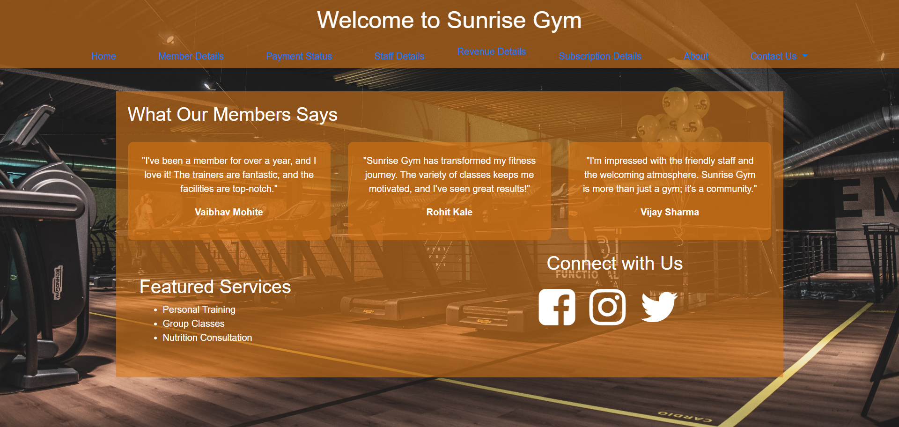
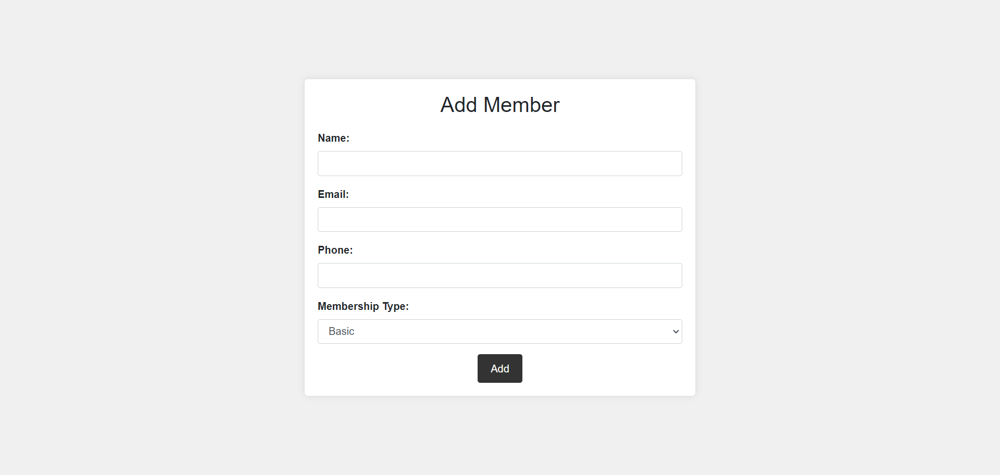
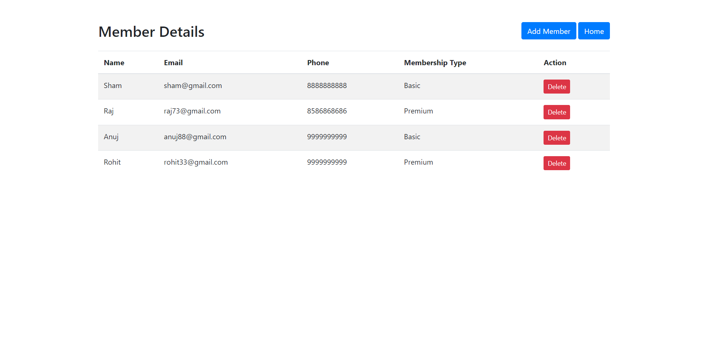
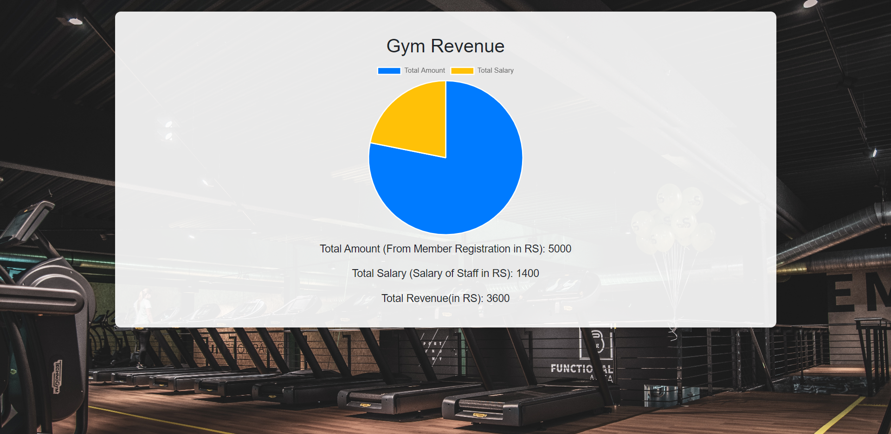

# Sunrise Gym Management System

Sunrise Gym Management System is built using EJS, Node.js, and MongoDB. It leverages Express for handling HTTP requests, Mongoose for MongoDB interactions, and Body Parser for request parsing.

## Table of Contents

- [Prerequisites](#prerequisites)
- [Getting Started](#getting-started)
- [Features](#features)
- [Screenshots](#screenshots)
- [Contact](#contact)

## Prerequisites

Ensure you have the following installed:

- **Node.js:** [Download Node.js](https://nodejs.org/)
- **MongoDB:** [Download MongoDB](https://www.mongodb.com/try/download/community)

## Getting Started

### 1. Download Project

Download the zip file and extract all files.

### 2. Navigate to the project directory:

```bash
cd gym-management-system
```

### 3. Install dependencies:

Run the following commands to install project dependencies:

```bash
npm init
npm install express mongoose body-parser
```

### 4. Configure MongoDB:

- Start MongoDB connection (Install MongoDB if not installed).
- Update the MongoDB connection string in the `app.js` file with the database name you want:

```javascript
mongoose.connect('mongodb://127.0.0.1/### your_database_name', {
  useNewUrlParser: true,
  useUnifiedTopology: true,
})
```

### 5. Run the application:

```bash
  nodemon app.js
```
- The application will be accessible at [localhost:3000](http://localhost:3000).

## Features

### Member Registration: Add new gym members.
### Membership Management: Update and manage memberships.
### Staff Management
### Rvenue overview

## Screenshots

## Home Page


## Addm Member


## Member details


## Revenue



## Contact

For any inquiries or feedback, please contact:

- **Email**:yuvrajsathe2801@gmail.com


